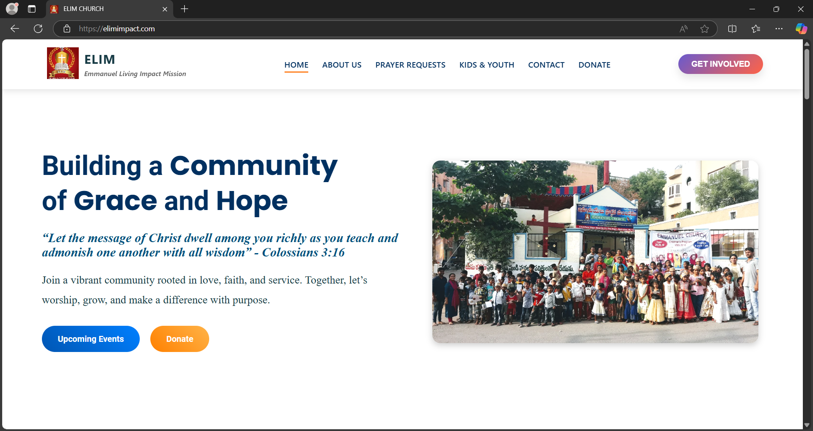

# Emmanuel Living Impact Mission (ELIM) - Church Website  

This is a **Next.js** project developed for **Emmanuel Living Impact Mission (ELIM)**, designed to provide a seamless user experience with optimized performance and responsiveness.  

  

**Emmanuel Living Impact Mission (ELIM) | Next.js, CSS Modules, EmailJS**  
📅 **Nov 2024 – Feb 2025**  
🛠 **Role:** Frontend Developer - Freelancer - https://elimimpact.com/  

- **Developed** a fully responsive church website, increasing user engagement by **40%**.  
- **Integrated** EmailJS for seamless contact form submissions, reducing manual efforts by **50%**.  
- **Optimized** the website’s design using **CSS Modules** and **Next.js best practices** for **faster load times** and **improved accessibility**.  
- **Resolved** third-party integration challenges while maintaining a **smooth UI/UX experience**.  
- **Collaborated** with stakeholders to ensure high-quality, **impact-driven** web solutions.  

## 🚀 Getting Started  

To run the project locally, follow these steps:  

```bash
npm run dev
# or
yarn dev
# or
pnpm dev
# or
bun dev
